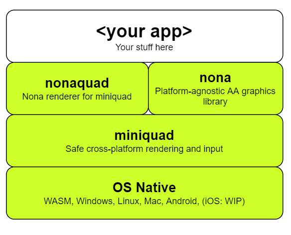

# nonaquad
Vector anti-aliased graphics renderer for Android, WASM, Desktop in Rust, using miniquad.

This library started as a port of [NanoVG](https://github.com/sunli829/nvg/tree/master/nvg-gl) for [miniquad](https://github.com/not-fl3/miniquad). Use this library if you want to draw graphics for a quick experiment (game, paint app, etc.) or if you want to build other libraries on top (e.g. UI library.)

## Notice
2022-02-18

I think this library is not good enough yet. I haven't worked on it for a while and not sure when I'll be able to again. I'm working on another app for note taking and wellbeing that I'd like to spend most of my time on.

I have a plan of making a very easy developer UI experience and interface for nona. However, at the moment I think it may be a mistake picking this library, unless you'd like to be a main contributor and help develop it further.

This said, please read below and see if any of the goals and ideas resonate with you:

## Goals
* small and fast executables for mobile, desktop and web. 
* safety
* high-quality drawing: anti-aliasing in shaders, squircles, gradients, fast blur
* 1-step or straight-forward build on all platforms
* ease-of-use
* minimal dependencies

## Supported platforms - same as miniquad:

|OS|Platform|
|---|----------|
|Windows| OpenGl 3|
|Linux| OpenGl 3|
| macOS| OpenGL 3|
| iOS| GLES 3|
| WASM| WebGl1 - tested on ios safari, ff, chrome|
| Android|GLES3|

## Not supported, but desirable platforms

* Android, GLES2 - work in progress.
* Metal

# Example

Located in [nonaquad/examples](nonaquad/examples).

Start with: `cargo run --example drawaa`
```rust
nona.begin_path();
nona.rect((100.0, 100.0, 300.0, 300.0));
nona.fill_paint(nona::Gradient::Linear {
    start: (100, 100).into(),
    end: (400, 400).into(),
    start_color: nona::Color::rgb_i(0xAA, 0x6C, 0x39),
    end_color: nona::Color::rgb_i(0x88, 0x2D, 0x60),
});
nona.fill().unwrap();

let origin = (150.0, 140.0);
nona.begin_path();
nona.circle(origin, 64.0);
nona.move_to(origin);
nona.line_to((origin.0 + 300.0, origin.1 - 50.0));
nona.stroke_paint(nona::Color::rgba(1.0, 1.0, 0.0, 1.0));
nona.stroke_width(3.0);
nona.stroke().unwrap();

nona.end_frame().unwrap();
```

# Screenshots
Screenshots produced from above example.

## Windows


## Web


WASM size before size stripping 754KB. With basic stripping (see below) 391 KB

## Android
APK size: 134KB

## iOS
(not yet ready)

# Building

## Linux

```bash
# ubuntu system dependencies
apt install libx11-dev libxi-dev libgl1-mesa-dev

cargo run --example drawaa
```

## Windows 

```bash
# both MSVC and GNU target is supported:
rustup target add x86_64-pc-windows-msvc
# or
rustup target add x86_64-pc-windows-gnu 

cargo run --example drawaa
```

## WASM
First time setup:
```bash
md examples
copy ./nonaquad/examples/index.html ./examples 
rustup target add wasm32-unknown-unknown
npm i -g simplehttpserver
```

Build and run:
```bash
cargo build --example drawaa --target wasm32-unknown-unknown --release
copy ".\target\wasm32-unknown-unknown\release\examples\drawaa.wasm" ".\examples\drawaa.wasm" /y

cd examples
simplehttpserver
```
Then open `http://localhost:8000`

### To reduce WASM size further
1. Install [binaryen toolkit](https://github.com/WebAssembly/binaryen/releases), then run:
```bash
wasm-opt.exe -Os -o drawaa.wasm drawaa.wasm
```
1. Run `cargo install twiggy` and check out the twiggy docs: https://rustwasm.github.io/twiggy/. E.g. you can run `twiggy top drawaa.wasm` to see where size is used most.
1. Set environment variable `RUSTFLAGS="-C link-arg=--strip-debug"`. **WARNING!** This will remove debug info from all cargo build-s. Make sure to revert RUSTFLAGS to "" (empty) after. Twiggy will also not report function details if you strip debug info.
1. Also check https://rustwasm.github.io/book/reference/code-size.html

## Android

Recommended way to build for android is using Docker.   
miniquad use slightly modifed version of `cargo-apk`

**Note:** on Windows if you see git error during `cargo apk build --example drawaa`, update your .git folder to be not read-only. See related [Docker issue #6016](https://github.com/docker/for-win/issues/6016)

```
docker run --rm -v $(pwd)":/root/src" -w /root/src notfl3/cargo-apk cargo apk build --example drawaa
docker run -it -v %cd%":/root/src" -w /root/src notfl3/cargo-apk bash
```

APK file will be in `target/android-artifacts/(debug|release)/apk`

With feature "log-impl" enabled all log calls will be forwarded to adb console.
No code modifications for Android required, everything just works.

## iOS
See build example for [miniquad](https://github.com/not-fl3/miniquad)

# Roadmap
The goal of nonaquad is to have a stable, high-quality vector library on mobile, web, and desktop from the same source code.

I will use it as a building block for a general purpose cross-platform app framework.

## Features
- [x] anti-aliased lines, circles, rect, rounded rect (signed distance field), curves
- [x] polygons - convex and concave
- [x] gradients
- [x] clipping
- [x] AA text
- [ ] [Work in progress] image and textures
- [ ] high-quality fast drop shadows and blur
- [ ] gradients - high quality dithered
- [ ] squircles

# Architecture
This is how the pieces fit together:



# Contributing
See TODO-s in source code or anything else goes

# License
MIT or APACHE at your convenience
